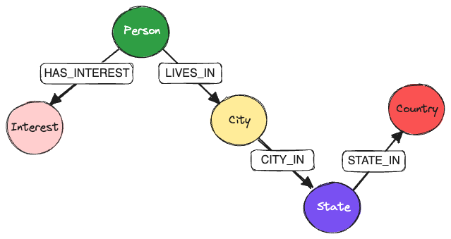
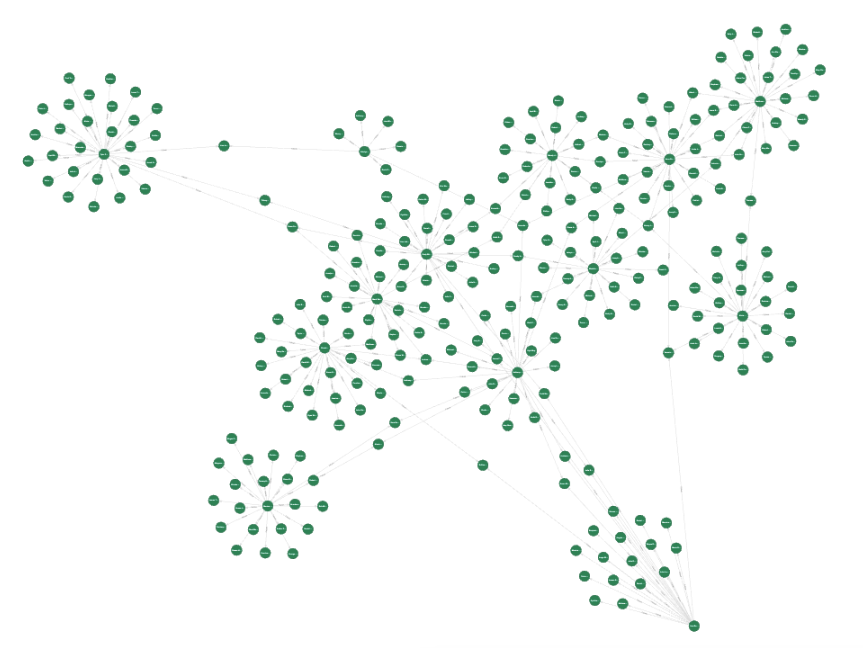

# KùzuDB: Benchmark study

Code for the benchmark study described in this [blog post](https://thedataquarry.com/posts/embedded-db-2/).

Neo4j version | Kùzu version |
:---: | :---: |
5.18.0 | 0.3.2 |


[Kùzu](https://kuzudb.com/) is an in-process (embedded) graph database management system (GDBMS) written in C++. It is blazing fast 🔥, and is optimized for handling complex join-heavy analytical workloads on very large graphs. Kùzu is being actively developed, and its [goal](https://kuzudb.com/docusaurus/blog/what-every-gdbms-should-do-and-vision) is to do in the graph data science space what DuckDB did in the world of tabular data science -- that is, to provide a fast, lightweight, embeddable graph database for analytics (OLAP) use cases, with minimal infrastructure setup.

This study has the following goals:

* Generate an artificial social network dataset, including persons, interests and locations
  * It's quite easy to scale up the size of the artificial dataset using the scripts provided, so we can test the performance implications on larger graphs
* Ingest the data into KùzuDB and Neo4j
* Run a set of queries in Cypher on either DB to:
  * (1) Verify that the data is ingested correctly and that the results from either DB are consistent with one another
  * (2) Benchmark the performance of Kùzu vs. an established vendor like Neo4j
* Study the ingestion and query times for either DB, and optimize where possible

Python is used as the intermediary language between the source data and the DBs.

## Setup

Activate a Python virtual environment and install the dependencies as follows.

```sh
python -m venv .venv
source .venv/bin/activate
pip install -r requirements.txt
```

## Data

An artificial social network dataset is generated specifically for this exercise, via the [Faker](https://faker.readthedocs.io/en/master/) Python library.

### Generate all data at once

A shell script `generate_data.sh` is provided in the root directory of this repo that sequentially runs the Python scripts, generating the data for the nodes and edges for the social network. This is the recommended way to generate the data. A single positional argument is provided to the shell script: The number of person profiles to generate -- this is specified as an integer, as shown below.

```sh
# Generate data with 100K persons and ~2.4M edges
bash generate_data.sh 100000
```

Running this command generates a series of files in the `output` directory, following which we can proceed to ingesting the data into a graph database.

See [./data/README.md](./data/README.md) for more details on each script that is run sequentially to generate the data.

## Graph schema

The following graph schema is used for the social network dataset.



* `Person` node `FOLLOWS` another `Person` node
* `Person` node `LIVES_IN` a `City` node
* `Person` node `HAS_INTEREST` towards an `Interest` node
* `City` node is `CITY_IN` a `State` node
* `State` node is `STATE_IN` a `Country` node

## Ingest the data into Neo4j or Kùzu

Navigate to the [neo4j](./neo4j) and the [kuzudb](./kuzudb/) directories to see the instructions on how to ingest the data into each database.

The generated graph is a well-connected graph, and a sample of `Person`-`Person` connections as visualized in the Neo4j browser is shown below. Certain groups of persons form a clique, and some others are central hubs with many connections, and each person can have many interests, but only one primary residence city.



## Run the queries

Some sample queries are run in each DB to verify that the data is ingested correctly, and that the results are consistent with one another.

The following questions are asked of both graphs:

* **Query 1**: Who are the top 3 most-followed persons?
* **Query 2**: In which city does the most-followed person live?
* **Query 3**: Which 5 cities in a particular country have the lowest average age in the network?
* **Query 4**: How many persons between ages 30-40 are there in each country?
* **Query 5**: How many men in London, United Kingdom have an interest in fine dining?
* **Query 6**: Which city has the maximum number of women that like Tennis?
* **Query 7**: Which U.S. state has the maximum number of persons between the age 23-30 who enjoy photography?
* **Query 8**: How many second-degree paths exist in the graph?
* **Query 9**: How many paths exist in the graph through persons age 50 to persons above age 25?


## Performance comparison

The run times for both ingestion and queries are compared.

* For ingestion, KùzuDB is consistently faster than Neo4j by a factor of **~18x** for a graph size of 100K nodes and ~2.4M edges.
* For OLAP queries, KùzuDB is **significantly faster** than Neo4j, especially for ones that involve multi-hop queries via nodes with many-to-many relationships.

### Benchmark conditions

The benchmark is run M3 Macbook Pro with 36 GB RAM.

### Ingestion performance

Case | Neo4j (sec) | Kùzu (sec) | Speedup factor
--- | ---: | ---: | ---:
Nodes | 2.4 | 0.2 | 12x
Edges | 30.9 | 0.4 | 77x
Total | 33.3 | 0.6 | 55x

Nodes are ingested significantly faster in Kùzu, and Neo4j's node ingestion remains of the order of seconds despite setting constraints on the ID fields as per their best practices. The speedup factors shown are expected to be even higher as the dataset gets larger and larger using this approach, and
the only way to speed up Neo4j data ingestion is to avoid using Python and use `admin-import` instead.

### Query performance benchmark

The full benchmark numbers are in the `README.md` pages for respective directories for `neo4j` and `kuzudb`, with the high-level summary shown below.

#### Notes on benchmark timing

The benchmarks are run via the `pytest-benchmark` library for the query scripts for either DB. `pytest-benchmark`, which is built on top of `pytest`, attaches each set of runs to a timer. It uses the Python time module's [`time.perf_counter`](https://docs.python.org/3/library/time.html#time.perf_counter), which has a resolution of 500 ns, smaller than the run time of the fastest query in this dataset.

* 5 warmup runs are performed to ensure byte code compilation and to warm up the cache prior to measuring run times
* Each query is run for a **minimum of 5 rounds**, so the run times shown in each section below as the **average over a minimum of 5 rounds**, and as many as 80-90 rounds.
  * Long-running queries (where the total run time exceeds 1 sec) are run for at least 5 rounds.
  * Short-running queries (of the order of milliseconds) will run as many times as fits into a period of 1 second, so the fastest queries run more than **80** rounds.
* Python's own GC overhead can obscure true run times, so it's disabled for the runtime computation

See the [`pytest-benchmark` docs](https://pytest-benchmark.readthedocs.io/en/latest/calibration.html) to see how they calibrate their timer and group the rounds.

#### Neo4j vs. Kùzu single-threaded

The following table shows the run times for each query (averaged over the number of rounds run, guaranteed to be a minimum of 5 runs) and the speedup factor of Kùzu over Neo4j when Kùzu is **limited to execute queries on a single thread**.

Query | Neo4j (sec) | Kùzu (sec) | Speedup factor
--- | ---: | ---: | ---:
1 | 1.7614 | 0.2722 | 6.5x
2 | 0.6149 | 0.3340 | 1.8x
3 | 0.0388 | 0.0112 | 3.5x
4 | 0.0426 | 0.0094 | 4.5x
5 | 0.0080 | 0.0037 | 2.2x
6 | 0.0212 | 0.0335 | 0.6x
7 | 0.1592 | 0.0070 | 22.7x
8 | 3.2919 | 0.0901 | 36.5x
9 | 4.0125 | 0.1016 | 39.5x

#### Neo4j vs. Kùzu multi-threaded

KùzuDB (by default) supports multi-threaded execution of queries. The following results are for the same queries as above, but allowing Kùzu to choose the optimal number of threads for each query. Again, the run times for each query (averaged over the number of rounds run, guaranteed to be a minimum of 5 runs) are shown.

Query | Neo4j (sec) | Kùzu (sec) | Speedup factor
--- | ---: | ---: | ---:
1 | 1.7614 | 0.1678 | 10.5x
2 | 0.6149 | 0.2025 | 3.0x
3 | 0.0388 | 0.0145 | 2.7x
4 | 0.0426 | 0.0136 | 3.1x
5 | 0.0080 | 0.0046 | 1.7x
6 | 0.0212 | 0.0346 | 0.6x
7 | 0.1592 | 0.0079 | 20.1x
8 | 3.2919 | 0.0777 | 42.4x
9 | 4.0125 | 0.0664 | 60.4x

> 🔥 The second-degree path-finding queries (8 and 9) show the biggest speedup over Neo4j, due to innovations in KùzuDB's query planner and execution engine.

### Ideas for future work

#### Scale up the dataset

It's possible to regenerate an artificial dataset of ~100M nodes and ~2.5B edges, and see how the performance of KùzuDB and Neo4j compare -- it's likely that Neo4j cannot handle 2-hop path-finding queries at that scale on a single node, so queries 8 and 9 can be disabled for that larger dataset.

```sh
# Generate data with 100M persons and ~2.5B edges (Might take a while in Python!) 
# Need to re-implement this in Rust: https://github.com/cksac/fake-rs
bash generate_data.sh 100000000
```

#### Relationship property aggregation

Aggregate on relationship properties to see how the two DBs compare.
  * In this initial benchmark, none of the edges have properties on them (all aggregations are on node properties)
  * It should be pretty simple to add a `since` date propery on the `Follows` edges to run filter queries on how long a person has been following another person
