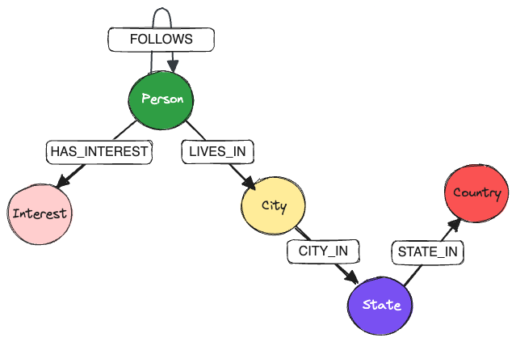

# KùzuDB: Benchmark study

[Kùzu](https://kuzudb.com/) is an in-process (embedded) graph database management system (GDBMS). Because it is written in C++, it is blazing fast 🔥, and is optimized for handling complex join-heavy analytical workloads on very large graphs. Kùzu is being actively developed, and its [goal](https://kuzudb.com/docusaurus/blog/what-every-gdbms-should-do-and-vision) is to do in the graph data science space what DuckDB did in the world of tabular data science -- that is, to provide a fast, lightweight, embeddable graph database for analytics (OLAP) use cases, with minimal infrastructure setup.

The code shown in this repo does the following:

* Generate an artificial social network dataset, including persons, interests and locations
  * It's quite easy to scale up the size of the artificial dataset using the scripts provided, so we can test the performance implications on larger graphs
* Ingest the data into KùzuDB and Neo4j
* Run a set of queries in Cypher on either DB to:
  * (1) Verify that the data is ingested correctly and that the results from either DB are consistent with one another
  * (2) Benchmark the performance of Kùzu vs. an established vendor like Neo4j
* Study the ingestion and query times for either DB, and optimize where possible

Python is used as the intermediary language between the source data and the DBs.

## Setup

Activate a Python virtual environment and install the dependencies as follows.

```sh
python -m venv .venv
source .venv/bin/activate
pip install -r requirements.txt
```

## Data

An artificial social network dataset is generated specifically for this exercise, via the [Faker](https://faker.readthedocs.io/en/master/) Python library.


### Generate all data at once

A shell script `generate_data.sh` is provided in the root directory of this repo that sequentially runs the Python scripts, generating the data for the nodes and edges for the social network. This is the recommended way to generate the data. A single positional argument is provided to the shell script: The number of person profiles to generate -- this is specified as an integer, as shown below.

```sh
# Generate data with 100K persons and ~2.4M edges
bash generate_data.sh 100000
```

Running this command generates a series of files in the `output` directory, following which we can proceed to ingesting the data into a graph database.

See [./data/README.md](./data/README.md) for more details on each script that is run sequentially to generate the data.

## Graph schema

The following graph schema is used for the social network dataset.



* `Person` node `FOLLOWS` another `Person` node
* `Person` node `LIVES_IN` a `City` node
* `Person` node `HAS_INTEREST` towards an `Interest` node
* `City` node is `CITY_IN` a `State` node
* `State` node is `STATE_IN` a `Country` node

## Ingest the data into Neo4j or Kùzu

Navigate to the [neo4j](./neo4j) and the [kuzudb](./kuzudb/) directories to see the instructions on how to ingest the data into each database.

The generated graph is a well-connected graph, and a sample of `Person`-`Person` connections as visualized in the Neo4j browser is shown below. Certain groups of persons form a clique, and some others are central hubs with many connections, and each person can have many interests, but only one primary residence city.


## Run the queries

Some sample queries are run in each DB to verify that the data is ingested correctly, and that the results are consistent with one another.

The following questions are asked of both graphs:

* **Query 1**: Who are the top 3 most-followed persons?
* **Query 2**: In which city does the most-followed person live?
* **Query 3**: Which 5 cities in a particular country have the lowest average age in the network?
* **Query 4**: How many persons between ages 30-40 are there in each country?
* **Query 5**: How many men in London, United Kingdom have an interest in fine dining?
* **Query 6**: Which city has the maximum number of women that like Tennis?
* **Query 7**: Which U.S. state has the maximum number of persons between the age 23-30 who enjoy photography?
* **Query 8**: How many second-degree connections of persons are reachable in the graph?

## Performance comparison

The run times for both ingestion and queries are compared.

* For ingestion, KùzuDB is consistently faster than Neo4j by a factor of **~18x** for a graph size of 100K nodes and ~2.4M edges.
* For OLAP queries, KùzuDB is **significantly faster** than Neo4j for most types of queries, especially for ones that involve aggregating on many-to-many relationships.

### Testing conditions

* Macbook Pro M2, 16 GB RAM
* All Neo4j queries are single-threaded as per their default configuration
* Neo4j version: `5.11.0`
* KùzuDB version: `0.0.8`
* The run times reported are for the 5th run, because we want to allow the cache to warm up before gauging query performance

### Ingestion performance

In total, ~100K nodes and ~2.5 million edges are ingested **~18x** faster in KùzuDB than in Neo4j.

Case | Neo4j (sec) | Kùzu (sec) | Speedup factor
--- | ---: | ---: | ---:
Nodes | 2.6353 | 0.0578 | 45.6
Edges | 36.1358 | 2.0335 | 17.8
Total | 38.7711 | 2.0913 | 18.5

Nodes are ingested significantly faster in Kùzu (of the order of milliseconds), and Neo4j's node ingestion remains of the order of seconds despite setting constraints on the ID fields as per their best practices. The speedup factors shown are expected to be even higher as the dataset gets larger and larger, with Kùzu being around two orders of magnitude faster for inserting nodes.

### Query performance benchmark

The full benchmark numbers are in the `README.md` pages for respective directories for `neo4j` and `kuzudb`. The benchmarks are run via the `pytest-benchmark` library directly from each directory for the queries on either DB.

#### Neo4j vs. Kùzu single-threaded

The following table shows the average run times for each query, and the speedup factor of Kùzu over Neo4j.

Query | Neo4j (sec) | Kùzu (sec) | Speedup factor
--- | ---: | ---: | ---:
1 | 1.7779 | 0.1936458 | 9.2
2 | 0.6530 | 0.2199212 | 3.0
3 | 0.0059 | 0.0078386 | 0.8
4 | 0.0449 | 0.0090962 | 4.9
5 | 0.0071 | 0.0046465 | 1.5
6 | 0.0194 | 0.0289518 | 0.7
7 | 0.1617 | 0.0075286 | 21.5
8 | 0.9017 | 0.0966538 | 9.3

#### Neo4j vs. Kùzu multi-threaded

Unlike Neo4j, KùzuDB supports multi-threaded execution of queries. The following results are for the same queries as above, but allowing Kùzu to choose the optimal number of threads for each query.

Query | Neo4j (sec) | Kùzu (sec) | Speedup factor
--- | ---: | ---: | ---:
1 | 1.7779 | 0.1254484 | 14.2
2 | 0.6530 | 0.1240414 | 5.3
3 | 0.0059 | 0.0071119 | 0.8
4 | 0.0449 | 0.0079267 | 5.7
5 | 0.0071 | 0.0048247 | 1.5
6 | 0.0194 | 0.0129322 | 1.5
7 | 0.1617 | 0.0068251 | 23.7
8 | 0.9017 | 0.0272117 | 33.1

> 🔥 The second-degree path finding query (8) shows the biggest speedup over Neo4j for the 100K node, 2.4M edge graph, and the average speedup over Neo4j across all queries when using Kùzu in multi-threaded mode is **~12x**.
